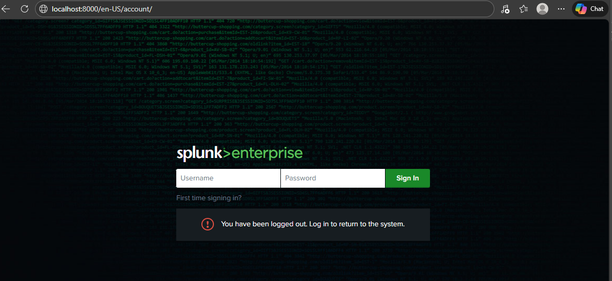
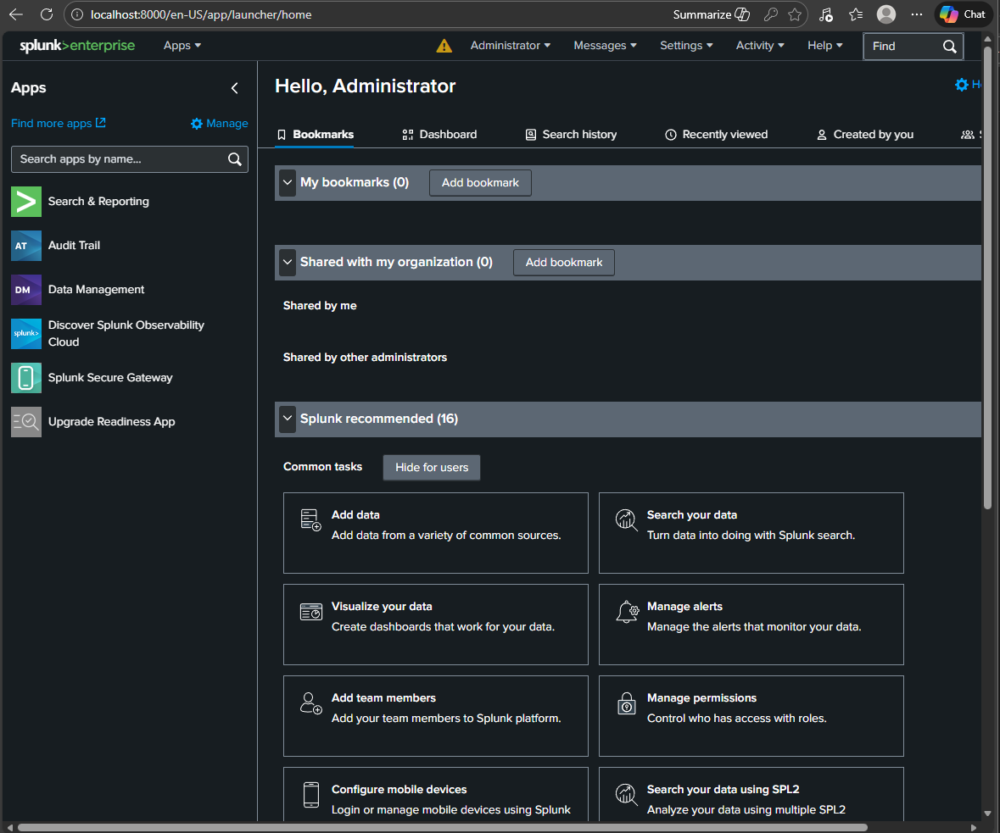
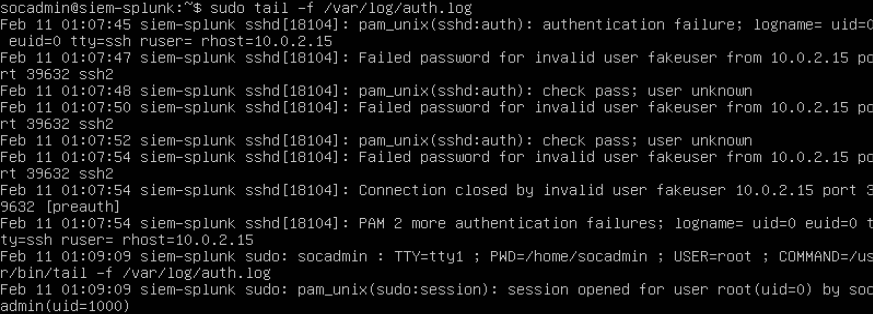
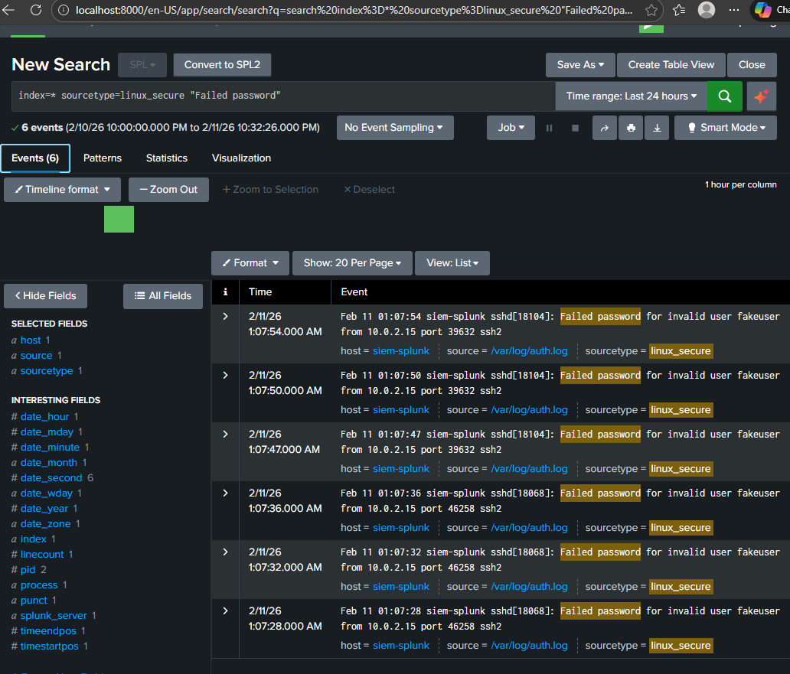
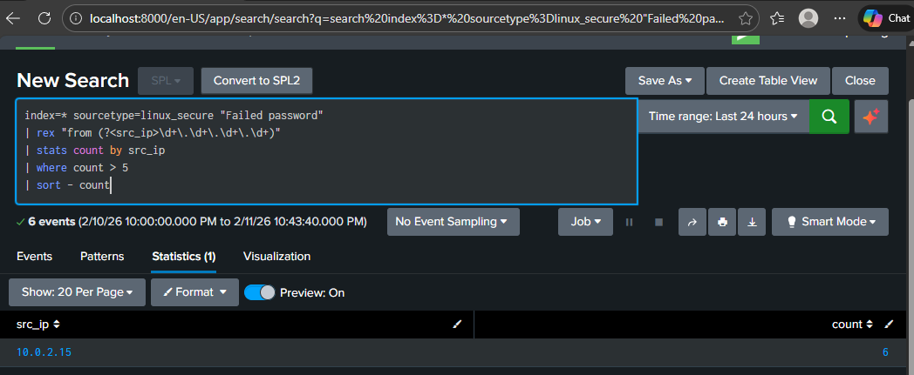
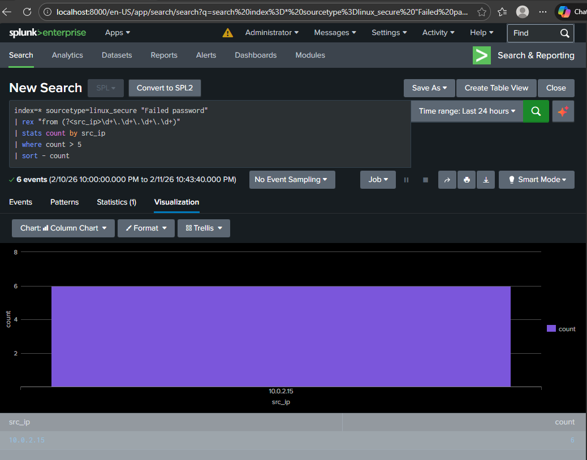

# SOC-Splunk-Lab –Splunk SIEM Deployment & SSH Brute Force Detection

## Overview
This project demonstrates the deployment and configuration of a Splunk SIEM environment in a virtual lab. The objective was to gain hands-on experience with:

## Lab Environment

| Component | Configuration |
|----------|--------------|
| Host OS | Windows 11 |
| Hypervisor | Oracle VirtualBox |
| Guest OS | Ubuntu Server |
| SIEM | Splunk Enterprise |
| Network | NAT with Port Forwarding (Port 8000) |

---

## Installation Steps
1. Install Ubuntu Server:

    Deployed Ubuntu Server VM using VirtualBox.

2. Install VirtualBox Guest Additions:

    Enabled clipboard sharing and shared folders.

3. Install Splunk Downloaded and installed the Splunk .deb package:

    sudo dpkg -i splunk-*.deb

4. Start Splunk:
   
    sudo /opt/splunk/bin/splunk start --accept-license

5. Enable Splunk at Boot:

    sudo /opt/splunk/bin/splunk enable boot-start -user socadmin

## Access
Splunk Web Interface:
http://localhost:8000

## Detection Use Case: SSH Brute Force

## Objective

Detect repeated failed SSH login attempts from the same source IP address using Splunk SPL.

## SPL Detection Query

index=* sourcetype=linux_secure "Failed password"
| rex "from (?<src_ip>\d+\.\d+\.\d+\.\d+)"
| stats count by src_ip
| where count > 5
| sort - count

## Detection Logic

1. Searches Linux authentication logs for failed SSH login attempts.
2. Extracts the source IP address using regex.
3. Counts failed attempts per IP address.
4. Filters for IPs with more than 5 failed login attempts.
5. Sorts results by highest number of failures.

## Sample Detection Output
| src_ip | count |
|----------|--------------|
| 10.0.2.15 | 6 |

This indicates a potential SSH brute force attempt from 10.0.2.15.

## Alert Configuration

- Name: SSH Brute Force Detection
- Type: Scheduled
- Trigger: Number of results > 0
- Action: Alert notification

## Skills Demonstrated 
- SIEM Deployment (Splunk)
- Log ingestion and analysis
- SPL query development
- Security alert configuration
- VirtualBox lab setup
- Linux administration
- Basic SOC detection workflow

## Screenshots

### Splunk Login Interface

### Splunk Dashboard

### SSH Attack Simulation

### Raw Failed Password Search

### Brute Force Detection Results

### Detection Visualization

